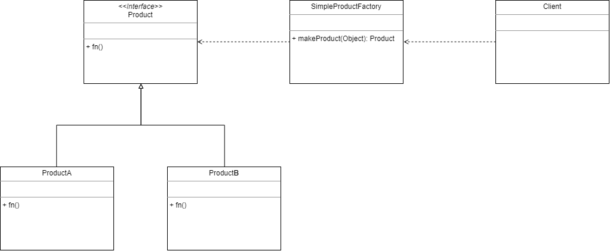
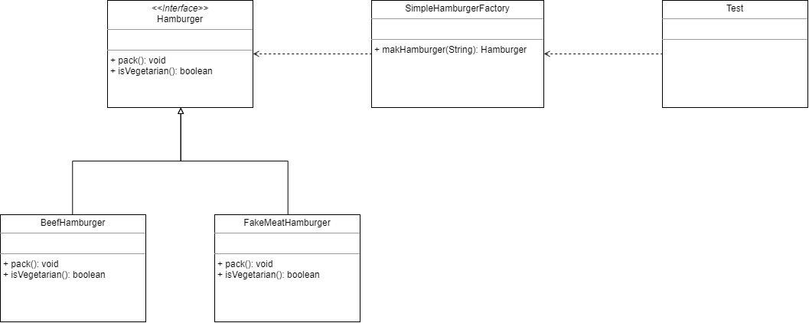
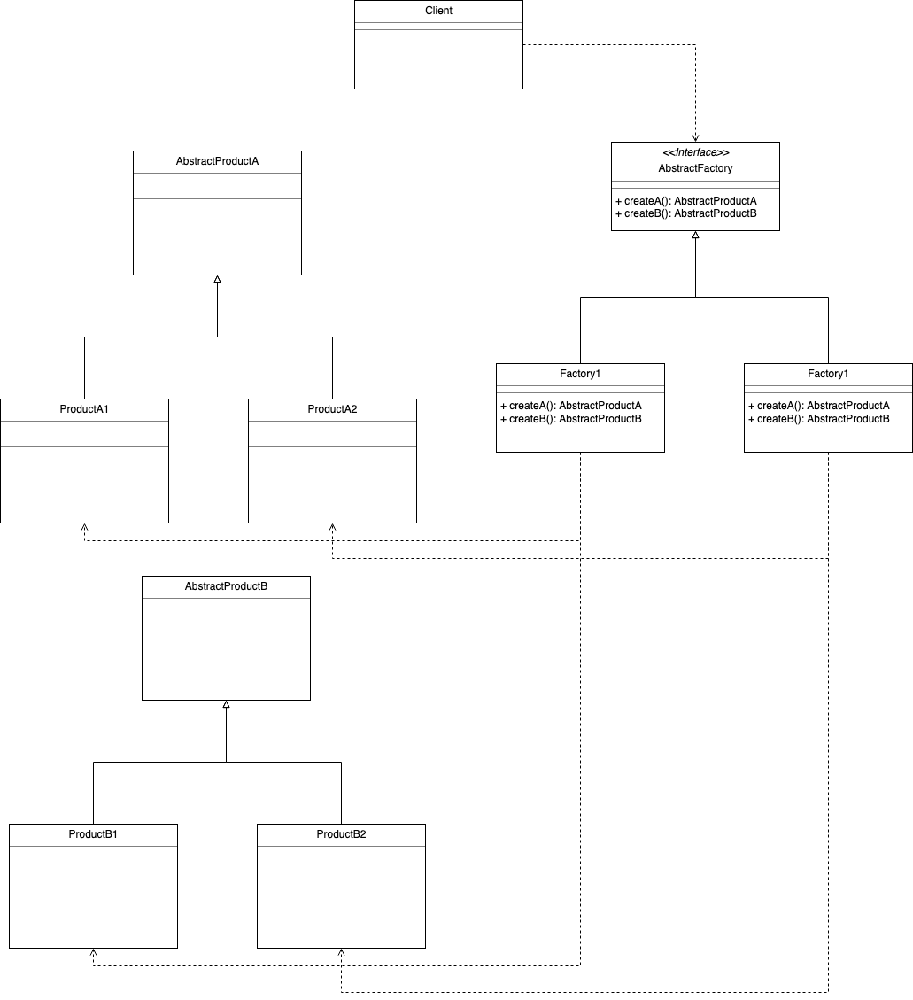
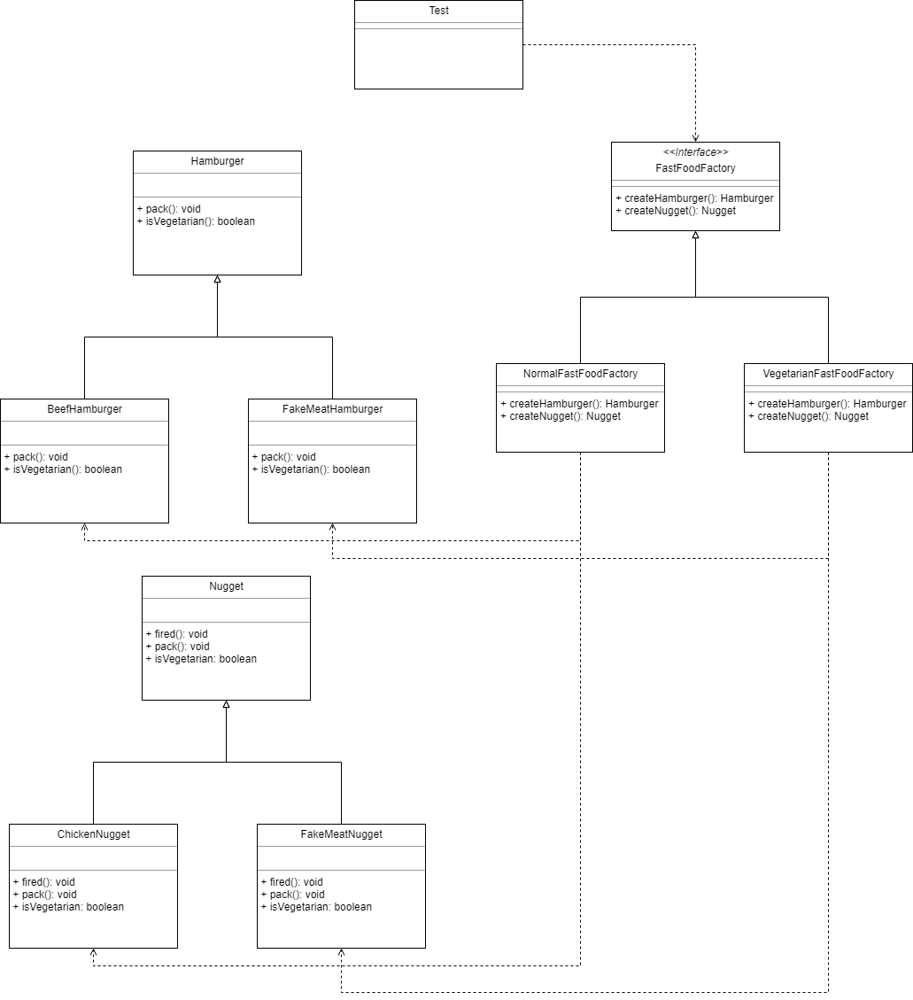
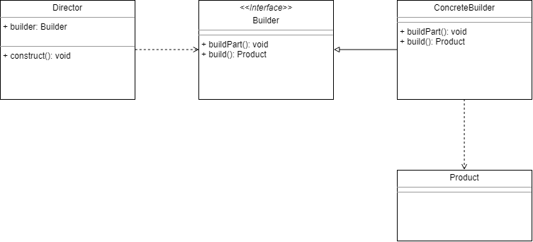
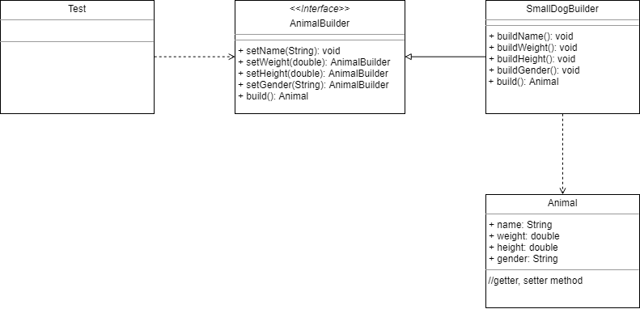
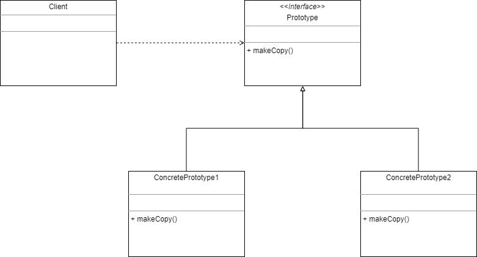
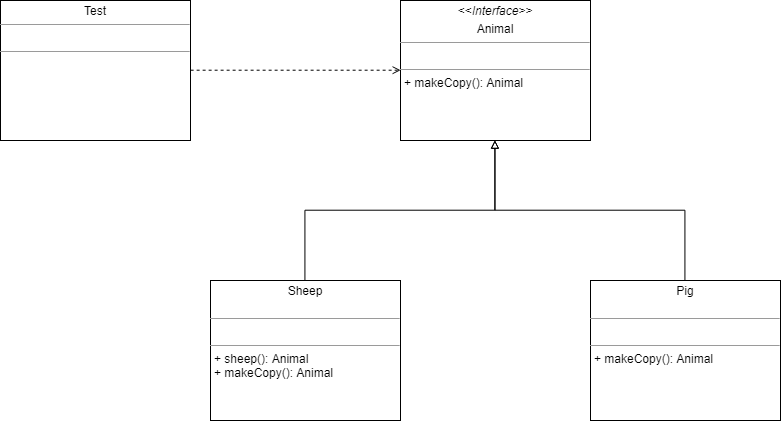

# Báo cáo tìm hiểu về mẫu thiết kế
Sinh viên: Hoàng Viết Khánh  
MSV: 20020296  
- - - -
Repo: https://github.com/kan01234/design-patterns  
Lý thuyết: *Design Patterns: Elements of Reusable Object-Oriented Software* được viết bởi các tác giả **Erich Gamma, Richard Helm, Ralph Johnson, John Vlissides**  
Tham khảo: https://gpcoder.com/4164-gioi-thieu-design-patterns  
- - - -
**Nhận xét chung: Vì đây là một repository có chủ đề về design pattern nên các file .java trong đó đều bám sát những nguyên tắc thiết kế được đề cập trong cuốn sách của *Gang of Four*.**  
23 folder chứa các file là ví dụ của 23 design pattern được liệt kê trong cuốn sách, chia làm 3 nhóm chính:  
<ol>
  <li>Creational</li>
  <li>Structural</li>
  <li>Behavioral</li>
</ol>  

## 1. Creational  
Những Design pattern loại này cung cấp một giải pháp để tạo ra các object và che giấu được logic của việc tạo ra nó, thay vì tạo ra object một cách trực tiếp bằng cách sử dụng method new. Điều này giúp cho chương trình trở nên mềm dẻo hơn trong việc quyết định object nào cần được tạo ra trong những tình huống được đưa ra.  
### 1.1. Singleton  
- Mỗi class chỉ khởi tạo **duy nhất MỘT** instance.
- Instance có thể được truy xuất một cách toàn cục bằng hàm public `getInstance()`.

**Sơ đồ thiết kế:**  

  

**Ví dụ:**  
```java
public class SingletonObject {

  private static SingletonObject instance  = new SingletonGreed();

  private SingletonObject() {
  }

  public static SingletonObject getInstance() {
    return instance;
  }

}
```  
**Nhận xét:**
- Dễ cài đặt.
- Hiệu suất cao.
- Tránh xung đột giữa các luồng.

### 1.2. (Simple) Factory  
- Đúng nghĩa là 1 *nhà máy* (factory), sản xuất ra các *sản phẩm* (product).
- Tạo đối tượng mà không để lộ logic tạo cho người dùng, khi tham chiếu sẽ chiếu đến đối tượng mới được tạo ra bởi một `interface` chung.
- Một *Super-class* được tạo ra, thường là `interface` hoặc `abstract class` kế thừa bởi các *sub-class* khác nhau với những logic khác nhau tượng trưng cho nhứng sản phẩm có thể được tạo ra.
- Một *Factory class* chịu trách nhiệm khởi tạo các sản phẩm dựa theo tham số đầu vào. **Lưu ý:** lớp này có thiết kế kiểu **Singleton** hoặc phải cung cấp một method dạng `public static` cho việc khởi tạo đối tượng, việc lựa chọn đối tượng có thể sử dụng cấu trúc phân nhánh `if-else` hoặc `switch-case`.

**Sơ đồ thiết kế:**  

  

**Ví dụ:**  


Hamburger, interface that define the product
```java
public interface Hamburger {
    public void pack();
    public boolean isVegetarian();
}
```

BeefHamburger, class that implement Hamburger, one of concrete products
```java
public class BeefHamburger implements Hamburger {
    @Override
    public void pack() {
        System.out.println("pack beef hamburger into paper box");
    }
    // other methods ....
}
```

FakeMeatHamburger, class that implment Hamburger, one of concrete products
```java
public class FakeMeatHamburger implements Hamburger {
    @Override
    public void pack() {
        System.out.println("pack fake meat hamburger with paper");
    }
    // other methods ....
}
```

SimpleHamburgerFactory, class that used to create concrete product and maintains factory method
```java
public class SimpleHamburgerFactory {
    public Hamburger makeHamburger(String order) {
        switch (order) {
            case "beef":
                return new BeefHamburger();
            case "fake meat":
                return new FakeMeatHamburger();
            default:
                return null;
        }
    }
}
```
Trong đó:  
- **Hamburger** là `abstract class` hoặc `interface`, quy định các hàm kế thừa từ chúng nhưng không quy định cụ thể các phương thức được kế thừa.
- **BeefHamburger** và **FakeMeatHamburger** là những class kế thừa từ **Hamburger**, kế thừa những phương thức trừu tượng từ lớp cha nhưng có hành vi khác nhau.
- Nếu như cần tạo thêm loại **Hamburger** nào mới thì chỉ cần cập nhật phương thức factory.

**Nhận xét:**
- Giảm sự phụ thuộc vào module.
- Dễ dàng mở rộng code.
- Thống nhất về cách đặt tên.
- Vi phạm *open-close principle* (quy tắc đóng-mở) của lập trình hướng đối tượng.

### 1.3. Abstract Factory  
- Tạo ra một *Super-factory* dùng để tạo ra các Factory khác.
- **Abstract Factory** là một pattern cấp cao hơn so với **Factory Method**.
- Một `interface` có nhiệm vụ tạo ra một Factory của các object có liên quan tới nhau mà không cần phải chỉ ra trực tiếp các class của object.

**Sơ đồ thiết kế:**  

  

**Ví dụ:**  


Hamburger interface
```java
public interface Hamburger {
    public void pack();
    public boolean isVegetarian();
}
```

BeefHamburger
```java
public class BeefHamburger implements Hamburger {
    @Override
    public void pack() {
        System.out.println("pack beef hamburger into paper box");
    }
    @Override
    public boolean isVegetarian() {
        return false;
    }
}
```

FakeMeatHamburger
```java
public class FakeMeatHamburger implements Hamburger {
    @Override
    public void pack() {
        System.out.println("pack fake meat hamburger with paper");
    }
    @Override
    public boolean isVegetarian() {
        return true;
    }
}
```

Nugget
```java
public interface Nugget {
    public void fired();
    public void pack();
    public boolean isVegetarian();
}
```

ChickenNugget
```java
public class ChickenNugget implements Nugget {
    @Override
    public void fired() {
        System.out.println("fired chicken nugget for 6 minutes");
    }
    @Override
    public void pack() {
        System.out.println("pack 6 pieces of chicken nugget into box");
    }
    @Override
    public boolean isVegetarian() {
        return false;
    }
}
```

FakeMeatNugget
```java
public class FakeMeatNugget implements Nugget {
    @Override
    public void fired() {
        System.out.println("fired fake meat nugget for 3 minutes");
    }
    @Override
    public void pack() {
        System.out.println("pack 9 pieces of fake meat nugget into box");
    }
    @Override
    public boolean isVegetarian() {
        return true;
    }
}
```

FastFoodFactory
```java
public interface FastFoodFactory {
    public Hamburger createHamburger();
    public Nugget createNugget();
}
```

NormalFastFoodFactory, class to create normal fast food
```java
public class NormalFastFoodFactory implements FastFoodFactory {
    @Override
    public Hamburger createHamburger() {
        return new BeefHamburger();
    }
    @Override
    public Nugget createNugget() {
        return new ChickenNugget();
    }
}
```

VegetarianFastFoodFactory, class to create vegetarian fast food
```java
public class VegetarianFastFoodFactory implements FastFoodFactory {
    @Override
    public Hamburger createHamburger() {
        return new FakeMeatHamburger();
    }
    @Override
    public Nugget createNugget() {
        return new FakeMeatNugget();
    }
}
```
Trong đó:
- **Hamburger** và **Nugget** là những `abstract class` hoặc `interface`, quy định các hàm kế thừa từ chúng nhưng không quy định cụ thể các phương thức được kế thừa.
- **BeefHamburger** và **FakeMeatHamburger** là những class kế thừa từ **Hamburger**, **ChickenNugget** và **FakeMeatNugget** là những class kế thừa từ **Nugget**, kế thừa những phương thức trừu tượng từ lớp cha nhưng có hành vi khác nhau.
- **FastFoodFactory** cài đặt kiểu `interface` hoặc `abstract class`.
- **NormalFastFoodFactory** và **VegetarianFastFoodFactory** kế thừa từ **FastFoodFactory**, dùng để tạo ra các **product** (**Hamburger** và **Nugget**).

**Nhận xét:**
- Có các ưu nhược điểm của **Factory**, thậm chí linh hoạt hơn trong khả năng khởi tạo đối tượng.
- Nhược điểm: phức tạp hơn **Factory**.

### 1.4. Builder  
- Xây dựng một đôi tượng phức tạp bằng cách sử dụng các đối tượng đơn giản.
- Xây dựng để khắc phục một số nhược điểm của **Factory** và **Abstract Factory** khi mà object có nhiều thuộc tính.
- Xử lí vấn đề bằng cách cung cấp một hàm khởi tạo với những tham số bắt buộc và các method `getter`/`setter` để cài đặt các tham số tùy chọn.

**Sơ đồ thiết kế:**  

  

**Ví dụ:**  

 
Animal
```java
public class Animal {
    private String name;
    private double weight;
    private double height;
    private String gender;
    // getter, setter methods
}
```

AnimalBuilder, interface that represent to builder
```java
public interface AnimalBuilder {
    public AnimalBuilder setName(String name);
    public AnimalBuilder setWeight(double weight);
    public AnimalBuilder setHeight(double height);
    public AnimalBuilder setGender(String gender);
    public Animal build();
}
```

SmallDogBuilder, class that represent to concrete builder
```java
public class SmallDogBuilder implements AnimalBuilder {
    private String name;
    private double weight;
    private double height;
    private String gender;
    @Override
    public Animal build() {
        return new Animal()
                .setName(name)
                .setWeight(weight)
                .setHeight(height)
                .setGender(gender);
    }
    @Override
    public AnimalBuilder setName(String name) {
        this.name = name;
        return this;
    }
    @Override
    public AnimalBuilder setWeight(double weight) {
        this.weight = weight;
        return this;
    }
    @Override
    public AnimalBuilder setHeight(double height) {
        this.height = height;
        return this;
    }
    @Override
    public AnimalBuilder setGender(String gender) {
        this.gender = gender;
        return this;
    }
}
```
**Nhận xét:**
- Code dễ đọc.
- Giảm lượng tham số truyền vào.
- Độ phức tạp về tổng thể tăng vì phải viết nhiều `concrete class` hơn và phải lặp lại code với mỗi class như vậy.

### 1.5. Prototype 
- Nó có nhiệm vụ khởi tạo một đối tượng bằng cách *clone* một đối tượng đã tồn tại thay vì khởi tạo với từ khoá new.
- Đối tượng mới là một bản sao có thể giống 100% với đối tượng gốc, chúng ta có thể thay đổi dữ liệu của nó mà không ảnh hưởng đến đối tượng gốc.

**Sơ đồ thiết kế:**  

  

**Ví dụ:**  

  
Animal, prototype interface

make it simple, just extends Cloneable class in Java
```java
public interface Animal extends Cloneable {

    public Animal makeCopy();

}
```

Sheep, Pig are ConcretePrototype
```java
public class Sheep implements Animal {

    public Sheep() {
        System.out.println("new Sheep");
    }

    public Animal makeCopy() {
        System.out.println("making a Sheep copy");
        Sheep sheep = null;
        try {
            sheep = (Sheep) super.clone();
        } catch (CloneNotSupportedException e) {
            e.printStackTrace();
        }
        return sheep;
    }

}
```

Pig
```java
public class Pig implements Animal {

    public Pig() {
        System.out.println("new Pig");
    }

    public Animal makeCopy() {
        System.out.println("making a Pig copy");
        Pig pig = null;
        try {
            pig = (Pig) super.clone();
        } catch (CloneNotSupportedException e) {
            e.printStackTrace();
        }
        return pig;
    }

}
```

**Nhận xét:**
- Giảm chi phí để tạo ra đối tượng mới.
- Giảm độ phức tạp cho việc khởi tạo.
- Giảm việc phân lớp, tránh việc tạo nhiều lớp con cho việc khởi tạo đối tượng như của **Abstract Factory**.
